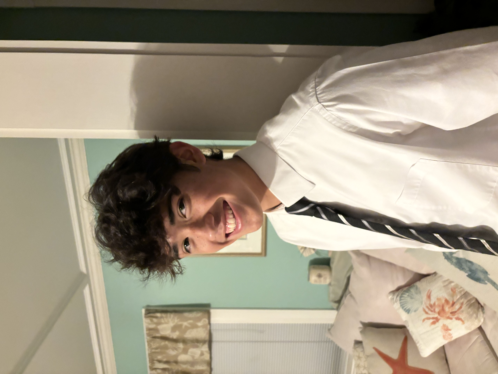

# Tim Harrington
Mechanical Engineering Student | The George Washington University

 

## About Me
My name is Tim Harrington and I am a freshman studying Mechanical Engineering at The George Washington University. I'm from Beverly Massachusetts and my interests include robotics, manufacturing, design, and automotives. I am apart of The Electric Yacht Club and a professional engineering fraternity (Theta Tau). I enjoy working with my hands and applying technical skills to solving practical challenges. This summer I will be working at Trillium Flow Technologies as a Manufacturing Engineer intern. Trillium Flow serves customers in the energy, nuclear and municipal sectors with highly engineered valves, pumps, and actuators.

## Explore My Work
- [Electric Yacht Club](./yacht.html)
- [Theta Tau](./thetatau.html)
- [SOLIDWORKS](./solidworks.html)

## Contact
- [LinkedIn](linkedin.com/in/tim-harrington10)
- [Handshake](https://gwu.joinhandshake.com/profiles/an7dkm)
- Email: [t.harrington@gwmail.gwu.edu](mailto:t.harrington@gwmail.gwu.edu)
