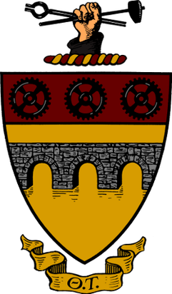
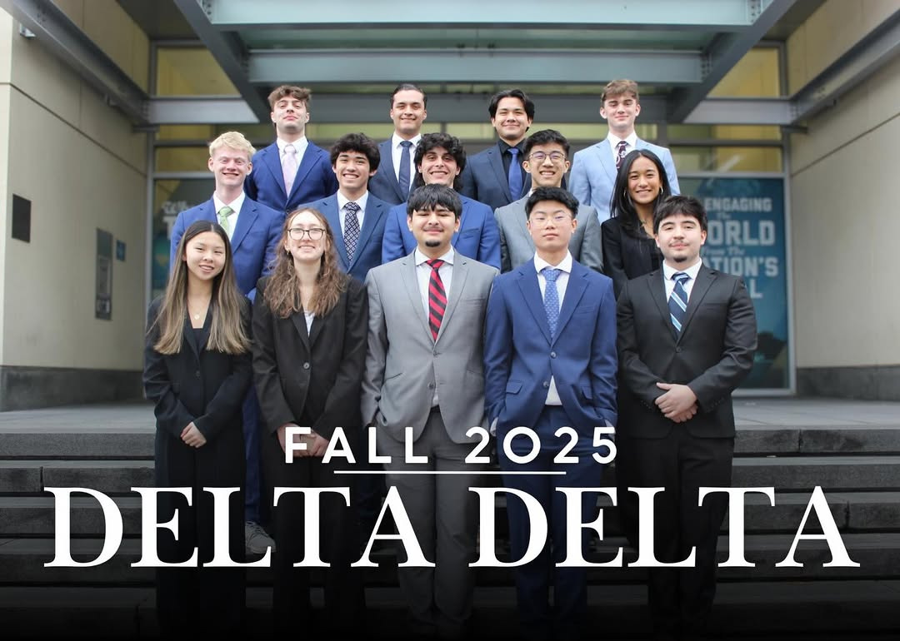
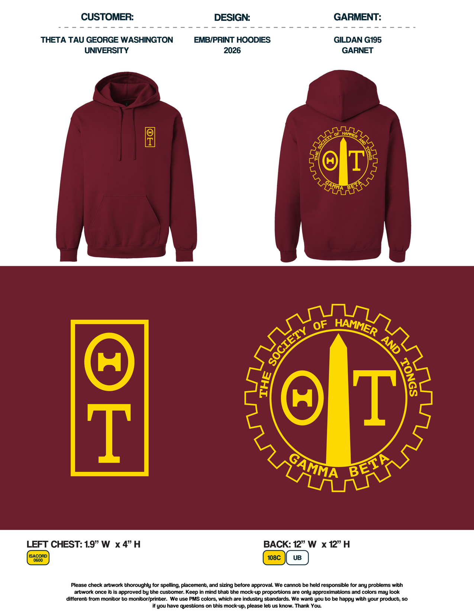

# Theta Tau 

## Overview
Theta Tau is a professional engineering fraternity founded in 1904 dedicated to fostering leadership, professional development, and a strong network among engineering students. With over 5,000 active members across more than 100 college campuses, Theta Tau emphasizes brotherhood, academic excellence, and preparing members for successful careers in engineering and related fields. The George Washington University chapter has over 80 active members and provides them with opportunities for professional growth, technical development, and community involvement within GW’s engineering community.

## Involvement
- Currently serve as Merchandise Chair for the GW chapter
- Recently designed a hoodie for the chapter and just placed an order for 40 with a local vendor 
- Apart of the Professional Development Committee
- Was able to aquire free SOLIDWORKS CSWA credits for members interested in taking the exam
- Helped to set up an Alumni career panel for members across various majors

  

## Skills Developed
- Resume building
- Networking
- Professional communication
- Project management
- Soldering
- Time management

